# Arquitectura de FSVR

Este documento describe la arquitectura de FSVR de arriba hacia abajo: primero el sistema en su
entorno, luego los contenedores (ejecutables y bibliotecas), después los componentes de cada uno y, por
último, las clases y los flujos de ejecución más importantes. Complementa a `AGENTS.md`, `CLAUDE.md` y
`STATUS.md`; si alguna afirmación de este documento discrepa de ellos, mandan ellos.

Fecha de redacción: 2026-10-06, sobre la rama `feature/revision` (commit `315bb8c`).

---

## 1. Qué es FSVR

FSVR es una reconstrucción en software del sintetizador Yamaha FS1R. El proyecto se divide en dos
mitades con naturalezas distintas, y esa división explica casi toda la estructura del código:

| Mitad | Qué contiene | Cómo se obtuvo | Estado epistemológico |
|---|---|---|---|
| **Firmware** | La lógica de control de la CPU (SH-2): MIDI, sysex, notas, controladores, Fseq | Reescrita en C++ a partir de la ROM v1.20 desensamblada | **KNOWN**: una discrepancia con el hardware es un bug |
| **Chips** | Los dos chips propios: YMP706 (generador de tono) y YSS236 / VOP3 (filtro y efectos) | Modelados y calibrados contra grabaciones de una unidad real | **INFERRED**: una discrepancia exige recalibrar |
| **FSVR** | Remuestreo, matemáticas rápidas, interfaz pública, plug-in | Código propio, sin equivalente en el hardware | Sin opinión del hardware |

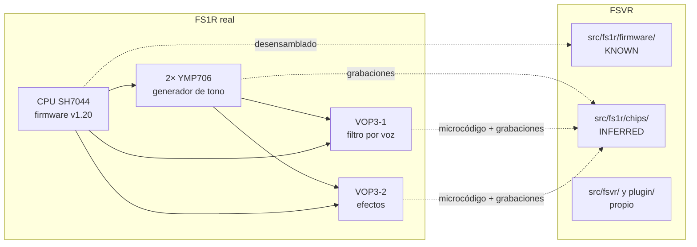
```mermaid
flowchart LR
    subgraph Hardware["FS1R real"]
        CPU["CPU SH7044<br/>firmware v1.20"]
        YMP["2× YMP706<br/>generador de tono"]
        VOP1["VOP3-1<br/>filtro por voz"]
        VOP2["VOP3-2<br/>efectos"]
        CPU --> YMP --> VOP1
        YMP --> VOP2
        CPU --> VOP1
        CPU --> VOP2
    end
    subgraph Software["FSVR"]
        FW["src/fs1r/firmware/<br/>KNOWN"]
        CH["src/fs1r/chips/<br/>INFERRED"]
        OUR["src/fsvr/ y plugin/<br/>propio"]
    end
    CPU -. "desensamblado" .-> FW
    YMP -. "grabaciones" .-> CH
    VOP1 -. "microcódigo + grabaciones" .-> CH
    VOP2 -. "microcódigo + grabaciones" .-> CH
```

---

## 2. Nivel 1: diagrama de contexto

FSVR se usa desde un host de audio (DAW), como aplicación standalone, o desde la línea de comandos para
renders y verificaciones. Alrededor del código hay personas y artefactos externos que alimentan la
calibración.

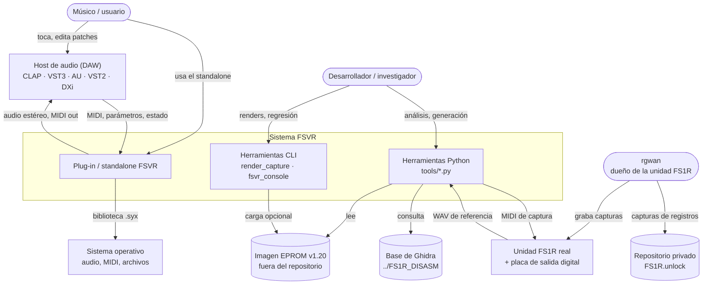
```mermaid
flowchart TB
    musico(["Músico / usuario"])
    daw["Host de audio (DAW)<br/>CLAP · VST3 · AU · VST2 · DXi"]
    so["Sistema operativo<br/>audio, MIDI, archivos"]
    dev(["Desarrollador / investigador"])
    rgwan(["rgwan<br/>dueño de la unidad FS1R"])
    unidad["Unidad FS1R real<br/>+ placa de salida digital"]
    eprom[("Imagen EPROM v1.20<br/>fuera del repositorio")]
    ghidra[("Base de Ghidra<br/>../FS1R_DISASM")]
    priv[("Repositorio privado<br/>FS1R.unlock")]

    subgraph FSVR["Sistema FSVR"]
        plugin["Plug-in / standalone FSVR"]
        cli["Herramientas CLI<br/>render_capture · fsvr_console"]
        tools["Herramientas Python<br/>tools/*.py"]
    end

    musico -- "toca, edita patches" --> daw
    musico -- "usa el standalone" --> plugin
    daw -- "MIDI, parámetros, estado" --> plugin
    plugin -- "audio estéreo, MIDI out" --> daw
    plugin -- "biblioteca .syx" --> so
    dev -- "renders, regresión" --> cli
    dev -- "análisis, generación" --> tools
    tools -- "lee" --> eprom
    tools -- "consulta" --> ghidra
    rgwan -- "graba capturas" --> unidad
    unidad -- "WAV de referencia" --> tools
    tools -- "MIDI de captura" --> unidad
    rgwan -- "capturas de registros" --> priv
    cli -- "carga opcional" --> eprom
```

| Actor / sistema externo | Relación con FSVR |
|---|---|
| Músico | Usa el plug-in dentro de un DAW o la aplicación standalone |
| Host de audio | Llama al procesador por bloques, le envía MIDI y guarda/restaura su estado |
| rgwan | Posee la unidad, la EPROM y realiza las sesiones de captura |
| jameshansen | Dueño del proyecto |
| Unidad FS1R | Referencia de verdad para todo lo INFERRED |
| EPROM v1.20 | Fuente del firmware, presets, tablas y microcódigo VOP3; no está en el repositorio |
| Ghidra (`../FS1R_DISASM`) | Desensamblado consultado por las herramientas de firmware |
| `FS1R.unlock` | Repositorio privado con capturas de registros; sus conclusiones están en `docs/captures/sessions.md` |

---

## 3. Nivel 2: contenedores

Un *contenedor* aquí es un artefacto que se compila o ejecuta por separado.

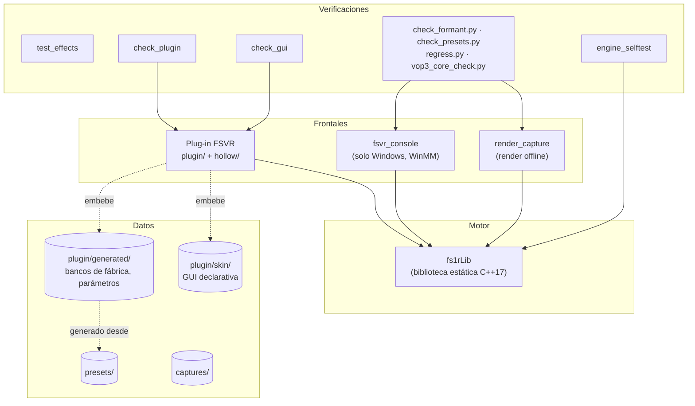
```mermaid
flowchart TB
    subgraph engine["Motor"]
        lib["fs1rLib<br/>(biblioteca estática C++17)"]
    end
    subgraph front["Frontales"]
        plug["Plug-in FSVR<br/>plugin/ + hollow/"]
        console["fsvr_console<br/>(solo Windows, WinMM)"]
        rc["render_capture<br/>(render offline)"]
    end
    subgraph checks["Verificaciones"]
        te["test_effects"]
        es["engine_selftest"]
        cp["check_plugin"]
        cg["check_gui"]
        py["check_formant.py · check_presets.py<br/>regress.py · vop3_core_check.py"]
    end
    subgraph data["Datos"]
        gen[("plugin/generated/<br/>bancos de fábrica, parámetros")]
        skin[("plugin/skin/<br/>GUI declarativa")]
        presets[("presets/")]
        caps[("captures/")]
    end

    plug --> lib
    console --> lib
    rc --> lib
    es --> lib
    cp --> plug
    cg --> plug
    plug -. "embebe" .-> gen
    plug -. "embebe" .-> skin
    py --> rc
    py --> console
    gen -. "generado desde" .-> presets
```

| Contenedor | Destino de CMake | Fuentes | Salida | Plataformas |
|---|---|---|---|---|
| Motor | `fs1rLib` | `src/fs1r/**`, `src/fsvr/*.cpp` | biblioteca estática | todas |
| Plug-in | `hollow_add_plugin(...)` en `plugin/CMakeLists.txt` | `plugin/*.cpp`, `hollow/` | `bin/<Formato>/` | Windows, macOS, Linux |
| Consola | `fsvr_console` | `src/console/main.cpp` | `bin/fsvr_console.exe` | solo Windows |
| Render offline | `render_capture` | `tools/render_capture.cpp` | `bin/render_capture` | todas |
| Self-check del motor | `engine_selftest` (o `fsvr_console -selftest`) | `tools/engine_selftest.cpp` | prueba `engine` de ctest | todas |
| Self-check de efectos | `test_effects` | `tools/test_effects.cpp` | prueba `effects` de ctest | todas |
| Pruebas del plug-in | `check_plugin`, `check_gui` | `tools/check_*.cpp` | pruebas `plugin` y `gui` | con `-DFSVR_BUILD_PLUGIN=ON` |

### 3.1 Formatos del plug-in

Hollow compila todos los formatos que la plataforma admite, filtrados por `HOLLOW_FORMATS`:

| Plataforma | Formatos |
|---|---|
| Windows x64 | CLAP, VST3, standalone (vía clap-wrapper), VST2 |
| Windows x86 | VST2 con DXi en la misma DLL |
| macOS | CLAP, VST3, AUv2, standalone `.app` (vía clap-wrapper), VST2 |
| Linux | CLAP, VST3, standalone (vía clap-wrapper), VST2 `.so`; editor en ventana X11 |

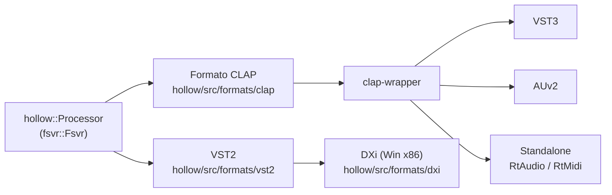
```mermaid
flowchart LR
    proc["hollow::Processor<br/>(fsvr::Fsvr)"] --> clap["Formato CLAP<br/>hollow/src/formats/clap"]
    clap --> cw["clap-wrapper"]
    cw --> vst3["VST3"]
    cw --> au["AUv2"]
    cw --> sa["Standalone<br/>RtAudio / RtMidi"]
    proc --> vst2["VST2<br/>hollow/src/formats/vst2"]
    vst2 --> dxi["DXi (Win x86)<br/>hollow/src/formats/dxi"]
```

---

## 4. Nivel 3: componentes

### 4.1 Mapa de directorios

| Ruta | Rol | Estado |
|---|---|---|
| `src/fs1r.h` | Única cabecera pública del motor: `fs1r::Device` | propio |
| `src/fs1r/internal.h` | Formatos decodificados, estado por canal, `struct Synth` | mixto |
| `src/fs1r/hardware.h` | Constantes leídas de la placa o del firmware (`SR`, `NCHAN`, `CPU_HZ`, `TICK_HZ`) | KNOWN |
| `src/fs1r/firmware/` | Port del firmware: `midi`, `patch`, `controllers`, `notes`, `fseq`, `rom` | KNOWN |
| `src/fs1r/firmware/tables.h`, `algorithms.h` | Tablas y 88 algoritmos extraídos de la EPROM | generados |
| `src/fs1r/chips/ymp706.cpp` | Operadores, EG, formantes, ruido, render por muestra | INFERRED |
| `src/fs1r/chips/vop3_filter.h` | Filtro por voz (escalera de 4 polos, SVF de 2 polos) y su EG | INFERRED |
| `src/fs1r/chips/vop3_effects.h` | Reverb, variación, inserción, EQ maestro | INFERRED |
| `src/fs1r/chips/vop3_core.h`, `vop3_modules.h` | Núcleo VOP3 medido que ejecuta el microcódigo del firmware | INFERRED |
| `src/fs1r/chips/cal.h` | Superficie de calibración: toda constante medida | INFERRED |
| `src/fsvr/device.cpp` | Implementación de `fs1r::Device`, remuestreo cúbico | propio |
| `src/fsvr/fastmath.*` | Backend matemático del bucle de muestra (RAW/LUT/CORDIC/HYBRID) | propio |
| `src/fsvr/tuning.h` | Perillas de costo que no deben alterar la salida | propio |
| `src/fsvr/selftest.cpp` | Auto-verificación de rutas sysex, RPN/NRPN, bank select | propio |
| `src/console/` | Consola de Windows | propio |
| `plugin/plugin.cpp` | Procesador `fsvr::Fsvr`: parámetros ⇄ sysex, morph, hilo worker | propio |
| `plugin/library.*` | Gestor de bancos `.syx` | propio |
| `plugin/audio_decode.cpp`, `audio_fseq.*` | Import Audio: archivo de audio → bytes de Fseq | propio |
| `plugin/skin/` | GUI declarativa (JSON + imágenes), editada con el editor web de Hollow | fuente |
| `plugin/generated/` | Bancos de fábrica y descripciones de parámetros | generados |
| `hollow/` | Framework de plug-in: formatos, runtime de skin, ventanas | propio (copia de Hollow) |
| `tools/` | Herramientas Python y C++: análisis, extracción, regresión, Ghidra | propio |
| `docs/` | Investigación, hallazgos, mediciones | — |
| `captures/` | Peticiones MIDI de medición (las grabaciones están en `.gitignore`) | datos |
| `presets/` | Voces, performances y Fseq de fábrica; DX7 | datos |

### 4.2 Capas del sistema

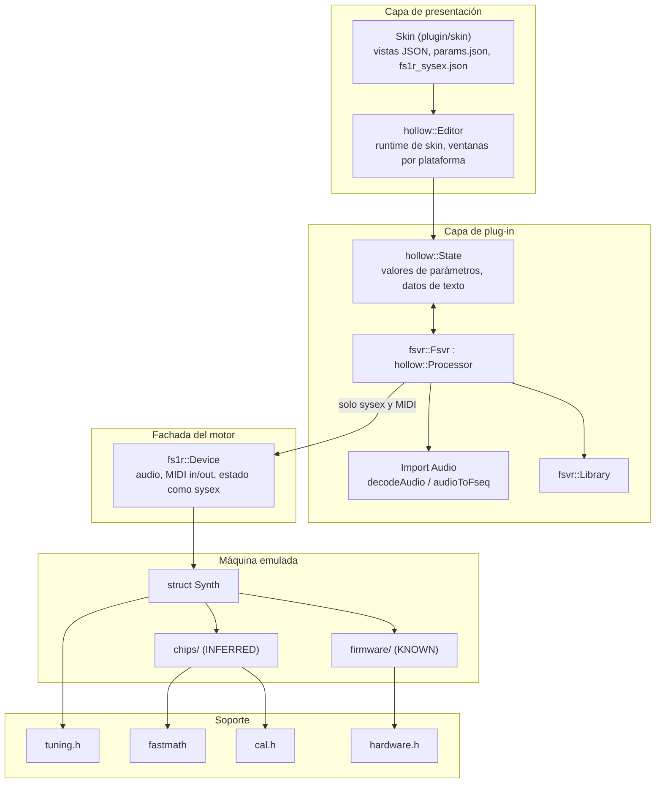
```mermaid
flowchart TB
    subgraph L4["Capa de presentación"]
        skin["Skin (plugin/skin)<br/>vistas JSON, params.json, fs1r_sysex.json"]
        hed["hollow::Editor<br/>runtime de skin, ventanas por plataforma"]
    end
    subgraph L3["Capa de plug-in"]
        fsvrp["fsvr::Fsvr : hollow::Processor"]
        libr["fsvr::Library"]
        imp["Import Audio<br/>decodeAudio / audioToFseq"]
        hst["hollow::State<br/>valores de parámetros, datos de texto"]
    end
    subgraph L2["Fachada del motor"]
        devc["fs1r::Device<br/>audio, MIDI in/out, estado como sysex"]
    end
    subgraph L1["Máquina emulada"]
        syn["struct Synth"]
        fw["firmware/ (KNOWN)"]
        chips["chips/ (INFERRED)"]
    end
    subgraph L0["Soporte"]
        hw["hardware.h"]
        cal["cal.h"]
        tun["tuning.h"]
        fm["fastmath"]
    end

    skin --> hed --> hst
    hst <--> fsvrp
    fsvrp --> libr
    fsvrp --> imp
    fsvrp -- "solo sysex y MIDI" --> devc
    devc --> syn
    syn --> fw
    syn --> chips
    fw --> hw
    chips --> cal
    chips --> fm
    syn --> tun
```

Dos reglas de dependencia sostienen este diagrama:

1. **El plug-in nunca pasa de `fs1r::Device`.** Mueve valores de parámetros como sysex, igual que un
   editor de hardware, y reconstruye el estado a partir de los volcados (*bulk dumps*) que el motor
   emite. No incluye `internal.h` y no calcula audio.
2. **Cada constante vive en su archivo según su procedencia.** `hardware.h` (leído), `cal.h` (medido),
   `tuning.h` (decisión de costo propia). Cambiar algo en `tuning.h` no debe mover ninguna medición.

### 4.3 Componentes del motor

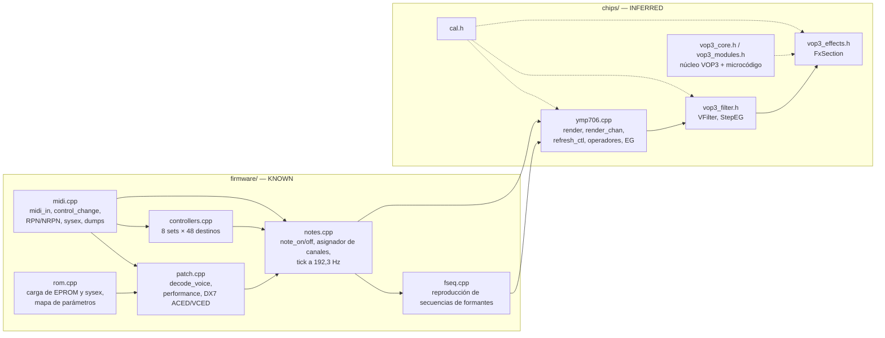
```mermaid
flowchart LR
    subgraph FW["firmware/ — KNOWN"]
        midi["midi.cpp<br/>midi_in, control_change,<br/>RPN/NRPN, sysex, dumps"]
        patch["patch.cpp<br/>decode_voice,<br/>performance, DX7 ACED/VCED"]
        ctrl["controllers.cpp<br/>8 sets × 48 destinos"]
        notes["notes.cpp<br/>note_on/off, asignador de canales,<br/>tick a 192,3 Hz"]
        fseq["fseq.cpp<br/>reproducción de secuencias de formantes"]
        rom["rom.cpp<br/>carga de EPROM y sysex,<br/>mapa de parámetros"]
    end
    subgraph CH["chips/ — INFERRED"]
        ymp["ymp706.cpp<br/>render, render_chan,<br/>refresh_ctl, operadores, EG"]
        flt["vop3_filter.h<br/>VFilter, StepEG"]
        fx["vop3_effects.h<br/>FxSection"]
        core["vop3_core.h / vop3_modules.h<br/>núcleo VOP3 + microcódigo"]
        cal["cal.h"]
    end
    midi --> patch
    midi --> ctrl
    midi --> notes
    patch --> notes
    ctrl --> notes
    notes --> fseq
    rom --> patch
    notes --> ymp
    fseq --> ymp
    ymp --> flt --> fx
    core -.-> fx
    cal -.-> ymp
    cal -.-> flt
    cal -.-> fx
```

| Componente | Responsabilidad | Ritmo de ejecución |
|---|---|---|
| `midi.cpp` | Decodifica mensajes de canal, sysex, RPN/NRPN, bank select, dump request | por mensaje |
| `patch.cpp` | Decodifica los 608 bytes de voz y los 400 de performance | por carga o edición |
| `controllers.cpp` | Matriz de 8 sets de controladores sobre 48 destinos (`FUN_00014DDC`, `FUN_00014AD0`, `FUN_000191C0`) | por tick |
| `notes.cpp` | Note on/off, modo mono y legato, asignador round-robin de 32 canales, `tick()` | por evento y a 192,3 Hz |
| `fseq.cpp` | Avance de cuadros de la Fseq, bucles, sincronía con reloj MIDI | a 192,3 Hz |
| `rom.cpp` | Carga la EPROM de 2 MB, presets y el mapa de parámetros sysex | por carga |
| `ymp706.cpp` | Síntesis por muestra: 8 operadores con voz + 8 sin voz por canal | 48 kHz |
| `vop3_filter.h` | Filtro por canal: lowpass de escalera 4 polos y SVF de 2 polos | 48 kHz |
| `vop3_effects.h` | Inserción → variación → reverb → EQ maestro de 3 bandas | 48 kHz |

### 4.4 Componentes del plug-in

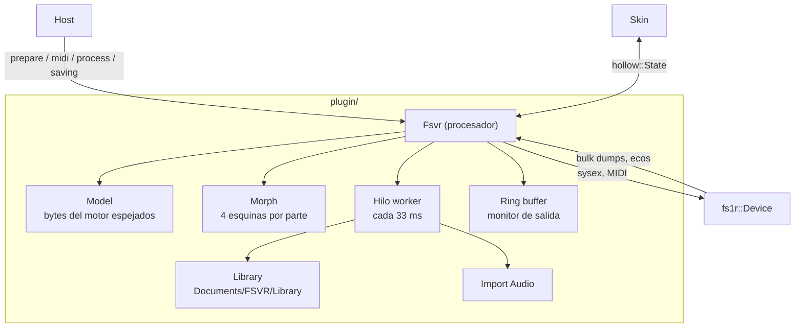
```mermaid
flowchart TB
    host["Host"] -- "prepare / midi / process / saving" --> fsvrp
    subgraph Plugin["plugin/"]
        fsvrp["Fsvr (procesador)"]
        model["Model<br/>bytes del motor espejados"]
        morph["Morph<br/>4 esquinas por parte"]
        worker["Hilo worker<br/>cada 33 ms"]
        libr["Library<br/>Documents/FSVR/Library"]
        imp["Import Audio"]
        ring["Ring buffer<br/>monitor de salida"]
    end
    fsvrp --> model
    fsvrp --> morph
    fsvrp --> worker
    worker --> libr
    worker --> imp
    fsvrp --> ring
    fsvrp -- "sysex, MIDI" --> dev["fs1r::Device"]
    dev -- "bulk dumps, ecos" --> fsvrp
    skin["Skin"] <-- "hollow::State" --> fsvrp
```

| Pieza | Archivo | Qué hace |
|---|---|---|
| `Fsvr` | `plugin/plugin.cpp` | Implementa `hollow::Processor`; traduce cada parámetro a un cambio de parámetro sysex según `data/fs1r_sysex.json` |
| Morph | `plugin/plugin.cpp` | Mezcla los bytes de cuatro voces de esquina en una sola voz bulk; no renderiza nada |
| Worker | `plugin/plugin.cpp` (`run`, `step`) | Carga patches y archivos, reescanea la biblioteca y devuelve al host lo que hizo el motor |
| `Library` | `plugin/library.*` | Lee archivos `.syx` como bancos de performances, voces y Fseq; importa, renombra, borra |
| Import Audio | `plugin/audio_decode.cpp`, `audio_fseq.cpp` | Decodifica WAV/AIFF/MP3/OGG/MP4 y escribe bytes de Fseq (32 de cabecera + 50 por cuadro) |
| Skin | `plugin/skin/` | 33 vistas JSON (páginas de operador, filtro, Fseq, efectos, biblioteca, diálogos) |

---

## 5. Nivel 4: clases

### 5.1 Fachada del motor y máquina emulada

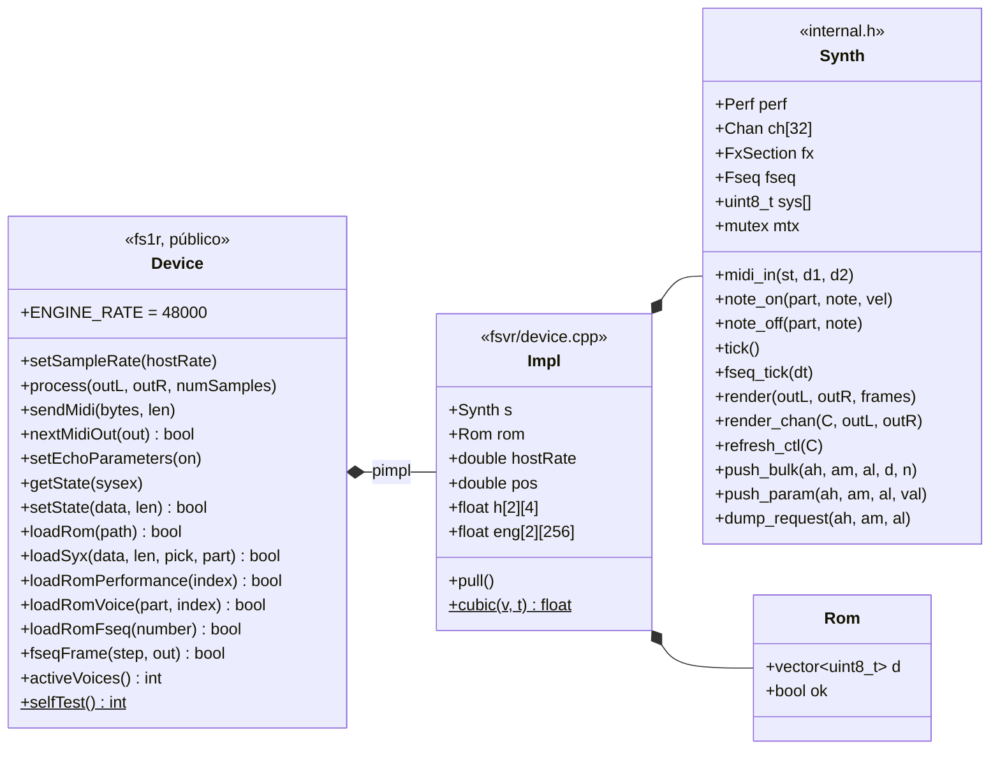
```mermaid
classDiagram
    direction LR
    class Device {
        <<fs1r, público>>
        +ENGINE_RATE = 48000
        +setSampleRate(hostRate)
        +process(outL, outR, numSamples)
        +sendMidi(bytes, len)
        +nextMidiOut(out) bool
        +setEchoParameters(on)
        +getState(sysex)
        +setState(data, len) bool
        +loadRom(path) bool
        +loadSyx(data, len, pick, part) bool
        +loadRomPerformance(index) bool
        +loadRomVoice(part, index) bool
        +loadRomFseq(number) bool
        +fseqFrame(step, out) bool
        +activeVoices() int
        +selfTest()$ int
    }
    class Impl {
        <<fsvr/device.cpp>>
        +Synth s
        +Rom rom
        +double hostRate
        +double pos
        +float h[2][4]
        +float eng[2][256]
        +pull()
        +cubic(v, t)$ float
    }
    class Synth {
        <<internal.h>>
        +Perf perf
        +Chan ch[32]
        +FxSection fx
        +Fseq fseq
        +uint8_t sys[]
        +mutex mtx
        +midi_in(st, d1, d2)
        +note_on(part, note, vel)
        +note_off(part, note)
        +tick()
        +fseq_tick(dt)
        +render(outL, outR, frames)
        +render_chan(C, outL, outR)
        +refresh_ctl(C)
        +push_bulk(ah, am, al, d, n)
        +push_param(ah, am, al, val)
        +dump_request(ah, am, al)
    }
    class Rom {
        +vector~uint8_t~ d
        +bool ok
    }
    Device *-- Impl : pimpl
    Impl *-- Synth
    Impl *-- Rom
```

### 5.2 Datos de performance, voz y canal

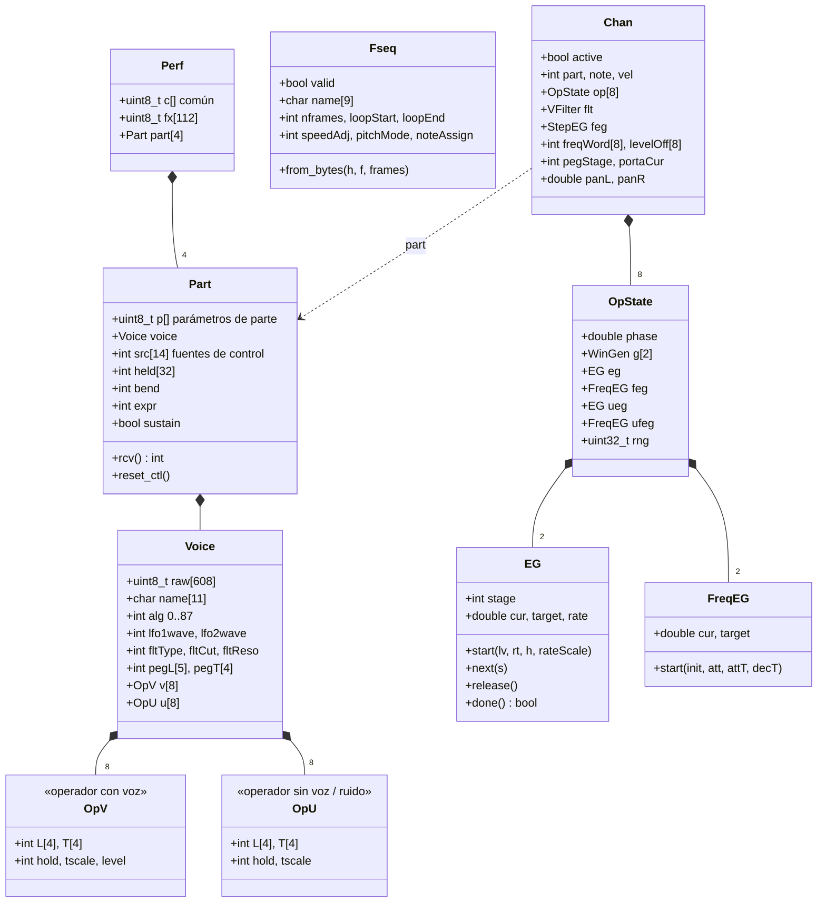
```mermaid
classDiagram
    direction TB
    class Perf {
        +uint8_t c[]  común
        +uint8_t fx[112]
        +Part part[4]
    }
    class Part {
        +uint8_t p[]  parámetros de parte
        +Voice voice
        +int src[14]  fuentes de control
        +int held[32]
        +int bend
        +int expr
        +bool sustain
        +rcv() int
        +reset_ctl()
    }
    class Voice {
        +uint8_t raw[608]
        +char name[11]
        +int alg  0..87
        +int lfo1wave, lfo2wave
        +int fltType, fltCut, fltReso
        +int pegL[5], pegT[4]
        +OpV v[8]
        +OpU u[8]
    }
    class OpV {
        <<operador con voz>>
        +int L[4], T[4]
        +int hold, tscale, level
    }
    class OpU {
        <<operador sin voz / ruido>>
        +int L[4], T[4]
        +int hold, tscale
    }
    class Fseq {
        +bool valid
        +char name[9]
        +int nframes, loopStart, loopEnd
        +int speedAdj, pitchMode, noteAssign
        +from_bytes(h, f, frames)
    }
    class Chan {
        +bool active
        +int part, note, vel
        +OpState op[8]
        +VFilter flt
        +StepEG feg
        +int freqWord[8], levelOff[8]
        +int pegStage, portaCur
        +double panL, panR
    }
    class OpState {
        +double phase
        +WinGen g[2]
        +EG eg
        +FreqEG feg
        +EG ueg
        +FreqEG ufeg
        +uint32_t rng
    }
    class EG {
        +int stage
        +double cur, target, rate
        +start(lv, rt, h, rateScale)
        +next(s)
        +release()
        +done() bool
    }
    class FreqEG {
        +double cur, target
        +start(init, att, attT, decT)
    }
    Perf *-- "4" Part
    Part *-- Voice
    Voice *-- "8" OpV
    Voice *-- "8" OpU
    Chan *-- "8" OpState
    OpState *-- "2" EG
    OpState *-- "2" FreqEG
    Chan ..> Part : part
```

| Estructura | Tamaño en el hardware | Fuente |
|---|---|---|
| Voz | 608 bytes | Data List, `patch.cpp` |
| Performance | 400 bytes | Data List, `patch.cpp` |
| Cuadro de Fseq | 50 bytes, tras 32 de cabecera | Data List, `fseq.cpp` |
| Canales | 32 (2 × YMP706 de 16) | `hardware.h` |
| Operadores por canal | 8 con voz + 8 sin voz | Data List |

### 5.3 Cadena de efectos y filtro

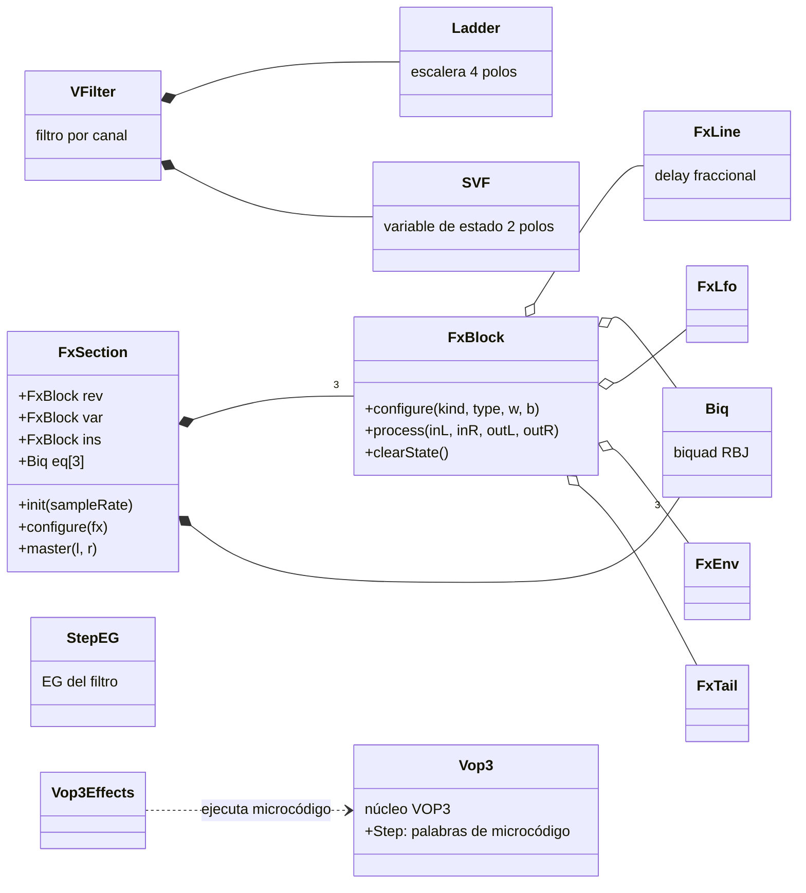
```mermaid
classDiagram
    direction LR
    class FxSection {
        +FxBlock rev
        +FxBlock var
        +FxBlock ins
        +Biq eq[3]
        +init(sampleRate)
        +configure(fx)
        +master(l, r)
    }
    class FxBlock {
        +configure(kind, type, w, b)
        +process(inL, inR, outL, outR)
        +clearState()
    }
    class FxLine { delay fraccional }
    class Biq { biquad RBJ }
    class FxLfo
    class FxEnv
    class FxTail
    class VFilter {
        filtro por canal
    }
    class Ladder { escalera 4 polos }
    class SVF { variable de estado 2 polos }
    class StepEG { EG del filtro }
    class Vop3 {
        núcleo VOP3
        +Step: palabras de microcódigo
    }
    class Vop3Effects
    FxSection *-- "3" FxBlock
    FxSection *-- "3" Biq
    FxBlock o-- FxLine
    FxBlock o-- Biq
    FxBlock o-- FxLfo
    FxBlock o-- FxEnv
    FxBlock o-- FxTail
    VFilter *-- Ladder
    VFilter *-- SVF
    Vop3Effects ..> Vop3 : ejecuta microcódigo
```

### 5.4 Plug-in y framework Hollow

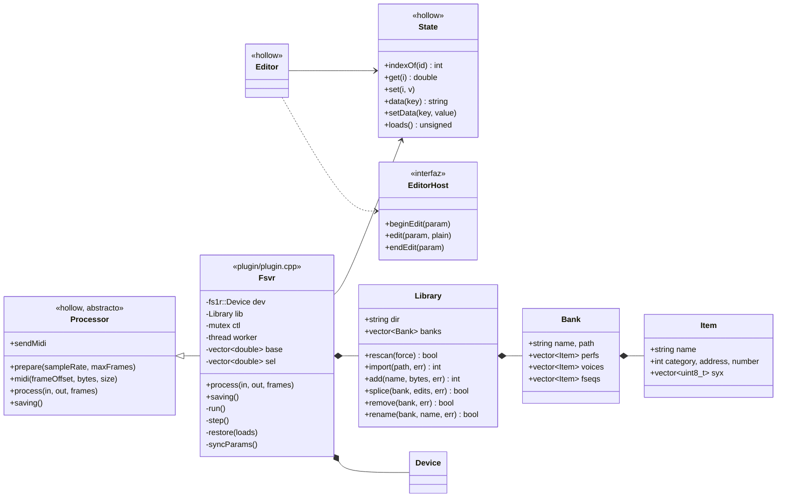
```mermaid
classDiagram
    direction LR
    class Processor {
        <<hollow, abstracto>>
        +prepare(sampleRate, maxFrames)
        +midi(frameOffset, bytes, size)
        +process(in, out, frames)
        +saving()
        +sendMidi
    }
    class State {
        <<hollow>>
        +indexOf(id) int
        +get(i) double
        +set(i, v)
        +data(key) string
        +setData(key, value)
        +loads() unsigned
    }
    class Editor {
        <<hollow>>
    }
    class EditorHost {
        <<interfaz>>
        +beginEdit(param)
        +edit(param, plain)
        +endEdit(param)
    }
    class Fsvr {
        <<plugin/plugin.cpp>>
        -fs1r::Device dev
        -Library lib
        -mutex ctl
        -thread worker
        -vector~double~ base
        -vector~double~ sel
        +process(in, out, frames)
        +saving()
        -run()
        -step()
        -restore(loads)
        -syncParams()
    }
    class Library {
        +string dir
        +vector~Bank~ banks
        +rescan(force) bool
        +import(path, err) int
        +add(name, bytes, err) int
        +splice(bank, edits, err) bool
        +remove(bank, err) bool
        +rename(bank, name, err) bool
    }
    class Bank {
        +string name, path
        +vector~Item~ perfs
        +vector~Item~ voices
        +vector~Item~ fseqs
    }
    class Item {
        +string name
        +int category, address, number
        +vector~uint8_t~ syx
    }
    Processor <|-- Fsvr
    Fsvr --> State
    Fsvr *-- Library
    Fsvr *-- Device
    Library *-- Bank
    Bank *-- Item
    Editor --> State
    Editor ..> EditorHost
```

---

## 6. Comportamiento dinámico

### 6.1 Bloque de audio en el plug-in

El hilo de audio nunca bloquea: intenta tomar `ctl` con `try_lock`. Si lo obtiene, sincroniza parámetros;
si no, sigue renderizando con lo que tiene. Los eventos MIDI se aplican en su posición exacta dentro del
bloque, partiendo el render en tramos.

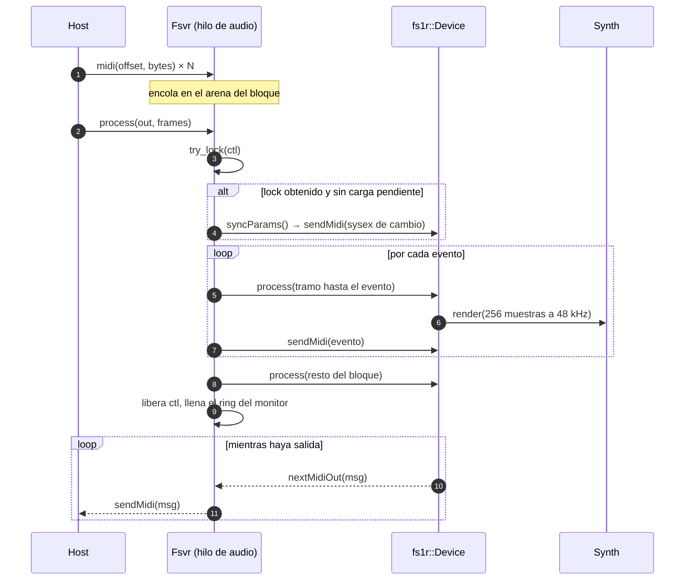
```mermaid
sequenceDiagram
    autonumber
    participant H as Host
    participant F as Fsvr (hilo de audio)
    participant D as fs1r::Device
    participant S as Synth
    H->>F: midi(offset, bytes) × N
    Note over F: encola en el arena del bloque
    H->>F: process(out, frames)
    F->>F: try_lock(ctl)
    alt lock obtenido y sin carga pendiente
        F->>D: syncParams() → sendMidi(sysex de cambio)
    end
    loop por cada evento
        F->>D: process(tramo hasta el evento)
        D->>S: render(256 muestras a 48 kHz)
        F->>D: sendMidi(evento)
    end
    F->>D: process(resto del bloque)
    F->>F: libera ctl, llena el ring del monitor
    loop mientras haya salida
        D-->>F: nextMidiOut(msg)
        F-->>H: sendMidi(msg)
    end
```

### 6.2 Render y remuestreo dentro del motor

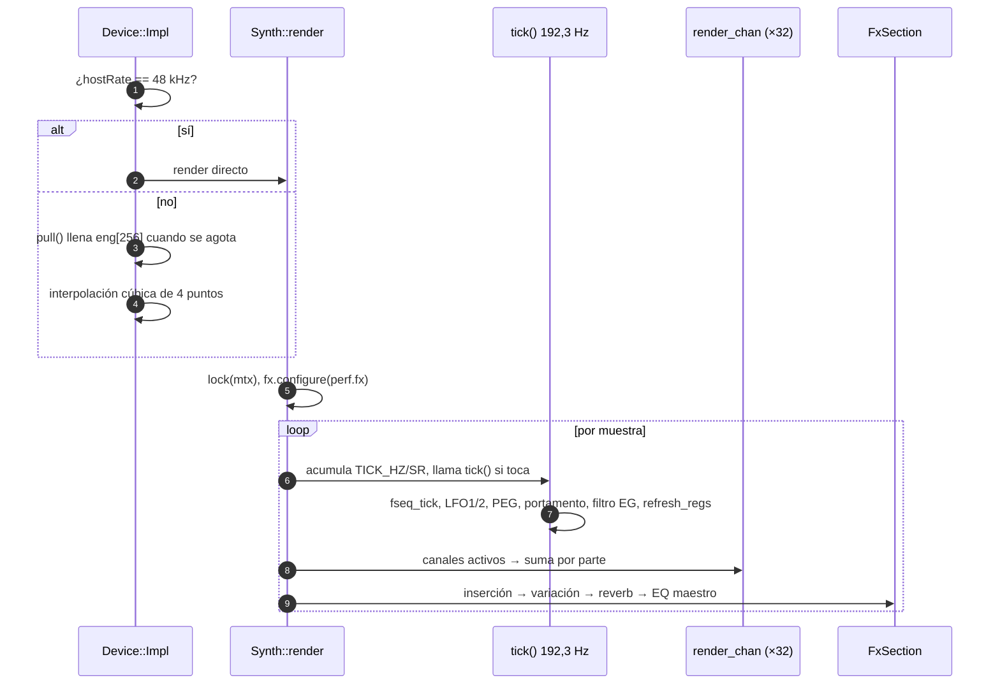
```mermaid
sequenceDiagram
    autonumber
    participant D as Device::Impl
    participant S as Synth::render
    participant T as tick() 192,3 Hz
    participant C as render_chan (×32)
    participant X as FxSection
    D->>D: ¿hostRate == 48 kHz?
    alt sí
        D->>S: render directo
    else no
        D->>D: pull() llena eng[256] cuando se agota
        D->>D: interpolación cúbica de 4 puntos
    end
    S->>S: lock(mtx), fx.configure(perf.fx)
    loop por muestra
        S->>T: acumula TICK_HZ/SR, llama tick() si toca
        T->>T: fseq_tick, LFO1/2, PEG, portamento, filtro EG, refresh_regs
        S->>C: canales activos → suma por parte
        S->>X: inserción → variación → reverb → EQ maestro
    end
```

La cadena de mezcla por muestra, tomada de `Synth::render` en `src/fs1r/chips/ymp706.cpp`:

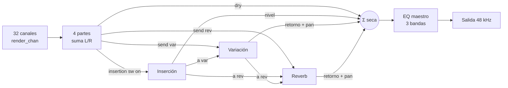
```mermaid
flowchart LR
    ch["32 canales<br/>render_chan"] --> parts["4 partes<br/>suma L/R"]
    parts -- "insertion sw on" --> ins["Inserción"]
    parts -- "dry" --> mix(("Σ seca"))
    parts -- "send var" --> var["Variación"]
    parts -- "send rev" --> rev["Reverb"]
    ins -- "nivel" --> mix
    ins -- "a var" --> var
    ins -- "a rev" --> rev
    var -- "retorno + pan" --> mix
    var -- "a rev" --> rev
    rev -- "retorno + pan" --> mix
    mix --> eq["EQ maestro<br/>3 bandas"] --> out["Salida 48 kHz"]
```

Un bloque cuyo resultado sale del rango razonable (±1e6) se vacía y se silencia esa muestra, para que
un parámetro absurdo no envenene el EQ maestro.

### 6.3 Note on, de MIDI a operador

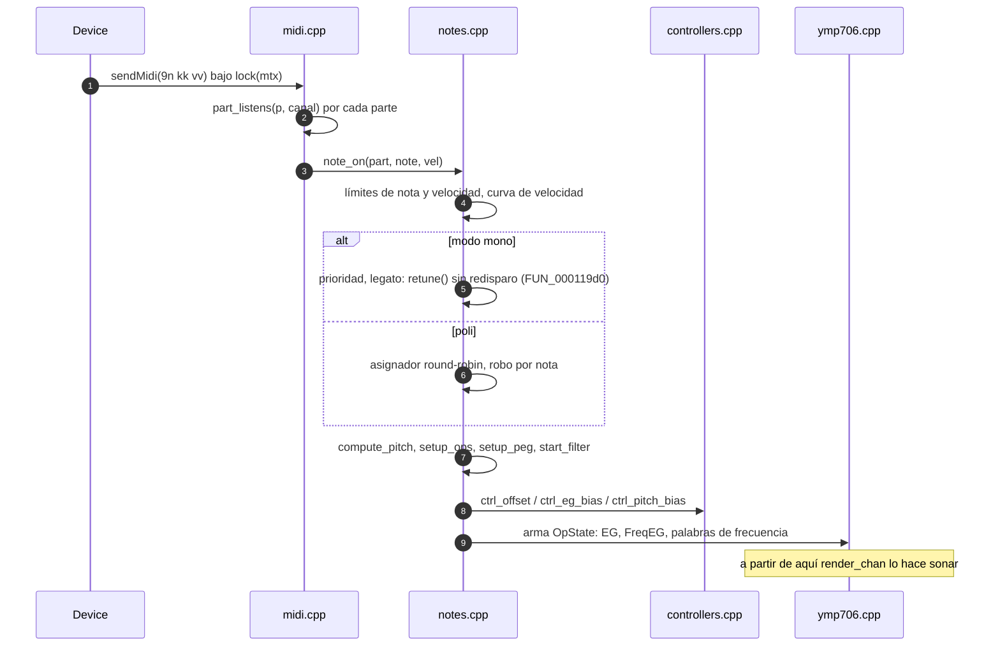
```mermaid
sequenceDiagram
    autonumber
    participant D as Device
    participant M as midi.cpp
    participant N as notes.cpp
    participant K as controllers.cpp
    participant Y as ymp706.cpp
    D->>M: sendMidi(9n kk vv) bajo lock(mtx)
    M->>M: part_listens(p, canal) por cada parte
    M->>N: note_on(part, note, vel)
    N->>N: límites de nota y velocidad, curva de velocidad
    alt modo mono
        N->>N: prioridad, legato: retune() sin redisparo (FUN_000119d0)
    else poli
        N->>N: asignador round-robin, robo por nota
    end
    N->>N: compute_pitch, setup_ops, setup_peg, start_filter
    N->>K: ctrl_offset / ctrl_eg_bias / ctrl_pitch_bias
    N->>Y: arma OpState: EG, FreqEG, palabras de frecuencia
    Note over Y: a partir de aquí render_chan lo hace sonar
```

### 6.4 Edición de un parámetro desde la GUI

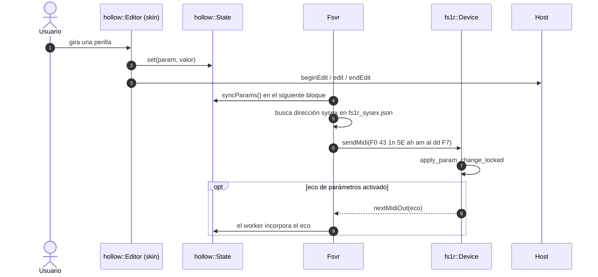
```mermaid
sequenceDiagram
    autonumber
    actor U as Usuario
    participant E as hollow::Editor (skin)
    participant St as hollow::State
    participant F as Fsvr
    participant D as fs1r::Device
    participant H as Host
    U->>E: gira una perilla
    E->>St: set(param, valor)
    E->>H: beginEdit / edit / endEdit
    F->>St: syncParams() en el siguiente bloque
    F->>F: busca dirección sysex en fs1r_sysex.json
    F->>D: sendMidi(F0 43 1n 5E ah am al dd F7)
    D->>D: apply_param_change_locked
    opt eco de parámetros activado
        D-->>F: nextMidiOut(eco)
        F->>St: el worker incorpora el eco
    end
```

### 6.5 Carga de patch, guardado y restauración de sesión

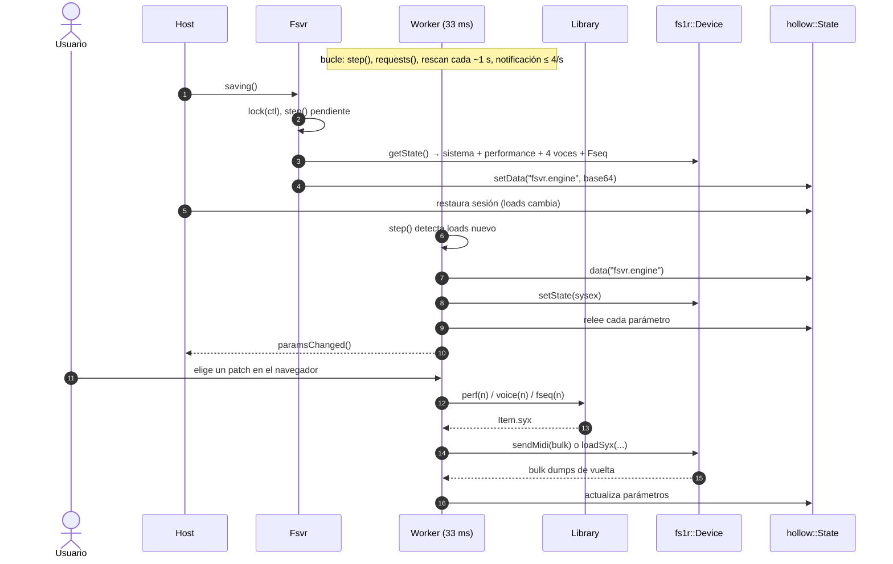
```mermaid
sequenceDiagram
    autonumber
    actor U as Usuario
    participant H as Host
    participant F as Fsvr
    participant W as Worker (33 ms)
    participant L as Library
    participant D as fs1r::Device
    participant St as hollow::State
    Note over W: bucle: step(), requests(), rescan cada ~1 s, notificación ≤ 4/s
    H->>F: saving()
    F->>F: lock(ctl), step() pendiente
    F->>D: getState() → sistema + performance + 4 voces + Fseq
    F->>St: setData("fsvr.engine", base64)
    H->>St: restaura sesión (loads cambia)
    W->>W: step() detecta loads nuevo
    W->>St: data("fsvr.engine")
    W->>D: setState(sysex)
    W->>St: relee cada parámetro
    W-->>H: paramsChanged()
    U->>W: elige un patch en el navegador
    W->>L: perf(n) / voice(n) / fseq(n)
    L-->>W: Item.syx
    W->>D: sendMidi(bulk) o loadSyx(...)
    D-->>W: bulk dumps de vuelta
    W->>St: actualiza parámetros
```

### 6.6 Import Audio

```mermaid
sequenceDiagram
    autonumber
    actor U as Usuario
    participant W as Worker
    participant A as audio_decode.cpp
    participant Q as audio_fseq.cpp
    participant L as Library
    participant D as fs1r::Device
    U->>W: Import Audio (archivo)
    W->>A: decodeAudio(path) → mono, rate
    Note over A: dr_wav, dr_mp3, stb_vorbis;<br/>MP4/AAC vía Media Foundation, Core Audio o ffmpeg
    W->>Q: audioToFseq(mono, rate, name)
    Q->>D: fseqWord(hz), fseqLevel(gain) (escalas del motor)
    Q-->>W: 32 B cabecera + 50 B × cuadros
    W->>L: add(name, bulk)
    W->>D: sendMidi(bulk Fseq)
```

### 6.7 Estados del EG de amplitud

`struct EG` en `internal.h` modela el EG del YMP706 (INFERRED; forma y tiempos en `docs/aeg.md`).

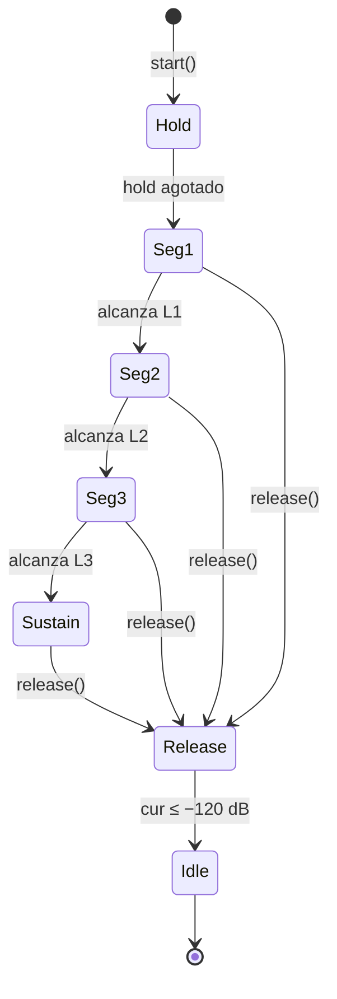
```mermaid
stateDiagram-v2
    [*] --> Hold: start()
    Hold --> Seg1: hold agotado
    Seg1 --> Seg2: alcanza L1
    Seg2 --> Seg3: alcanza L2
    Seg3 --> Sustain: alcanza L3
    Sustain --> Release: release()
    Seg1 --> Release: release()
    Seg2 --> Release: release()
    Seg3 --> Release: release()
    Release --> Idle: cur ≤ −120 dB
    Idle --> [*]
```

---

## 7. Hilos y concurrencia

| Hilo | Dueño | Qué toca | Sincronización |
|---|---|---|---|
| Audio | host | `Fsvr::process`, `Device::process`, `Synth::render` | `try_lock(ctl)`; `Synth::mtx` dentro del motor |
| Worker | `Fsvr` | carga de patches, biblioteca, `restore`, `harmonics`, notificaciones | `lock(ctl)`; `condition_variable` para despertar y salir |
| GUI | host / Hollow | `hollow::State`, eventos de skin | `State` lee y escribe valores sin lock |
| Guardado | host | `Fsvr::saving` | `lock(ctl)` y completa el `step()` pendiente |

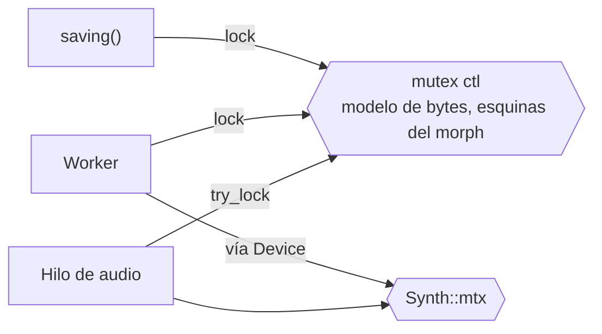
```mermaid
flowchart LR
    A["Hilo de audio"] -- "try_lock" --> ctl{{"mutex ctl<br/>modelo de bytes, esquinas del morph"}}
    W["Worker"] -- "lock" --> ctl
    G["saving()"] -- "lock" --> ctl
    A --> m{{"Synth::mtx"}}
    W -- "vía Device" --> m
```

---

## 8. Tiempo y frecuencias

| Magnitud | Valor | Origen |
|---|---|---|
| Frecuencia del motor | 48 000 Hz | DAC maestro en I2S a 512 Fs, cristal de 24,576 MHz (`hardware.h`) |
| Reloj de CPU | 28 MHz | SCI BRR 27 → 31 250 baudios |
| Tick de control | 192,3 Hz | MTU2 TGRA cada 0x238B cuentas a clock/16 |
| Temporizador de cuadro Fseq | CMT1 a clock/32 | `fseq_start` en `fseq.cpp` |
| Bloque interno de render | 256 muestras | `Device::Impl::eng` |
| Período del worker | 33 ms | `Fsvr::run` |

Solo `render`, `render_chan` y `refresh_ctl` corren por muestra; todo lo que alcanza `tick()` es de
control. Como el motor siempre corre a 48 kHz y se remuestrea a la salida, la temporización de un patch
es idéntica en cualquier frecuencia del host.

---

## 9. Datos generados y su origen

```mermaid
flowchart LR
    eprom[("EPROM v1.20")] --> ext["tools/extract_tables.py"]
    ext --> th["firmware/tables.h<br/>firmware/algorithms.h"]
    eprom --> ep["tools/extract_presets.py"]
    ep --> pr[("presets/")]
    pr --> mpb["tools/make_presets_blob.py"]
    mpb --> g1["fs1r_presets.syx / .csv<br/>1408 voces"]
    mpb --> g2["fs1r_performances.syx<br/>384 performances"]
    mpb --> g3["fs1r_fseqs.syx<br/>90 Fseq"]
    dl[("Data List<br/>tablas MIDI")] --> gp["tools/gen_parameters.py"]
    gp --> g4["parameterDescriptions_fs1r.json<br/>893 parámetros"]
    g4 -. "una vez, luego editado a mano" .-> skin["plugin/skin/params.json<br/>data/fs1r_sysex.json"]
    g1 --> emb["hollow_embed_files"]
    g2 --> emb
    g3 --> emb
    emb --> bin["binario del plug-in"]
    py["tools/vop3_interp.py"] -. "port bit a bit,<br/>vop3_core_check.py" .-> vc["chips/vop3_core.h"]
```

| Archivo | Generador | ¿Se edita a mano? |
|---|---|---|
| `src/fs1r/firmware/tables.h`, `algorithms.h` | `tools/extract_tables.py` | no |
| `plugin/generated/*` | `tools/make_presets_blob.py`, `tools/gen_parameters.py` | no |
| `plugin/skin/**` | ninguno (editor web de Hollow) | sí, es la fuente |
| `src/fs1r/chips/vop3_core.h` | port manual de `tools/vop3_interp.py` | sí, pero primero el Python |

---

## 10. Ciclo de calibración

Lo INFERRED se mueve a KNOWN con evidencia. El circuito pasa por la unidad real y vuelve a `cal.h`.

```mermaid
flowchart LR
    req["tools/make_capture_set.py<br/>→ captures/requests/*.mid"] --> unit["Unidad FS1R<br/>(rgwan)"]
    unit --> hw["captures/hardware/*.wav"]
    req --> rc["bin/render_capture"]
    rc --> eng["captures/engine/*.wav"]
    hw --> an["tools/analyze_capture.py"]
    eng --> an
    an --> js["captures/analysis/*.json"]
    js --> find["docs/findings.md<br/>docs/fidelity_plan.md"]
    find --> cal["src/fs1r/chips/cal.h"]
    cal --> rc
```

Una constante ajustada contra una sola grabación no cuenta como medida: hacen falta dos conjuntos de
datos o una traza del firmware (ver la entrada del 2026-09-19 en `docs/findings.md`).

---

## 11. Compilación y verificación

```mermaid
flowchart TB
    subgraph motor["cmake -B build/cmake"]
        a1["fs1rLib"] --> a2["render_capture"]
        a1 --> a3["engine_selftest"]
        a4["test_effects"]
    end
    subgraph plug["cmake -B build/plugin -DFSVR_BUILD_PLUGIN=ON"]
        b0["descarga SDK: CLAP, VST3, AU,<br/>clap-wrapper, RtAudio/RtMidi, decoders"] --> b1["hollow_core"]
        b1 --> b2["formatos en bin/&lt;Formato&gt;/"]
        b2 --> b3["check_plugin"]
        b2 --> b4["check_gui"]
    end
    motor --> pyc["check_formant.py · check_presets.py"]
    motor --> reg["regress.py (19 casos)"]
```

| Cuándo | Qué correr | Qué verifica |
|---|---|---|
| Siempre | `build.bat test` o `cmake` + `ctest` + `check_formant.py` + `check_presets.py` | efectos, motor, formantes, bancos de fábrica |
| Tocaste `plugin/`, `hollow/` o la skin | `build.bat plugin` o `ctest -R "plugin|gui"` | procesador como lo usa un host, editor como lo usa un ratón |
| Tocaste la ruta de audio | `tools/regress.py` | tono, armónicos, envolvente, ancho estéreo, centroide |
| El cambio no debe alterar la salida | hash de un render antes y después | identidad bit a bit |
| Tocaste `vop3_core.h` | `tools/vop3_core_check.py` | identidad con `vop3_interp.py` |

En macOS y Linux la referencia de `regress.py` es de una compilación de Windows (`rand()` difiere), así
que se toma una huella con `--update` antes del cambio, se guarda aparte y se compara después.

---

## 12. Decisiones de arquitectura

| Decisión | Motivo | Consecuencia |
|---|---|---|
| Separar `firmware/` y `chips/` por procedencia | Una discrepancia significa cosas distintas en cada mitad | Saber qué hacer ante un error depende solo de la ruta del archivo |
| `fs1r::Device` como única interfaz, con estado en sysex | El plug-in se comporta como un editor de hardware | El plug-in no puede romper la fidelidad del motor; el estado es portable |
| Motor fijo a 48 kHz con remuestreo cúbico a la salida | El hardware corre a 48 kHz | Temporización idéntica en cualquier host; posible aliasing sobre ~15 kHz a 44,1 kHz |
| Todas las constantes medidas en `cal.h` | Calibrar debe ser editar una tabla | Cada valor cita el documento que lo midió |
| `tuning.h` separado de `cal.h` | Distinguir costo de fidelidad | Cambiar una perilla de costo no debe mover ninguna medición |
| Hilo de audio con `try_lock` | Tiempo real sin bloqueos | Un bloque puede saltarse la sincronización de parámetros y aplicarla en el siguiente |
| Skin declarativa editada en sitio | La GUI no tiene contraparte en el hardware | Un cambio de parámetros se replica a mano en `params.json` y `fs1r_sysex.json` |
| Archivos generados versionados | El plug-in no necesita Python para compilar | No se editan a mano; `check_presets.py` detecta bancos desactualizados |

---

## 13. Dónde seguir leyendo

| Tema | Documento |
|---|---|
| Qué se sabe, qué se modela, qué se ignora | `STATUS.md` |
| Registro de investigación | `docs/findings.md` |
| Distancia a cada grabación | `docs/fidelity_plan.md` |
| EG, formantes, falda, ruido, detune, filtro | `docs/aeg.md`, `docs/formant.md`, `docs/skirt.md`, `docs/noise.md`, `docs/detune.md`, `docs/filter.md` |
| Registros del YMP706 y despacho MIDI | `docs/ymp706_registers.md`, `docs/midi_dispatch.md` |
| VOP3 | `docs/vop3_isa.md`, `docs/vop3_blockers.md`, `docs/vop3_2_microcode.md`, `docs/vop3_2_params.md` |
| Editor y parámetros | `docs/editor.md`, `plugin/generated/README.md`, `hollow/docs/skin-format.md` |
| Framework Hollow | `hollow/docs/framework.md` |
| Diferencias intencionales con el hardware | `docs/Differences.md` |
| Rendimiento | `docs/performance.md` |
